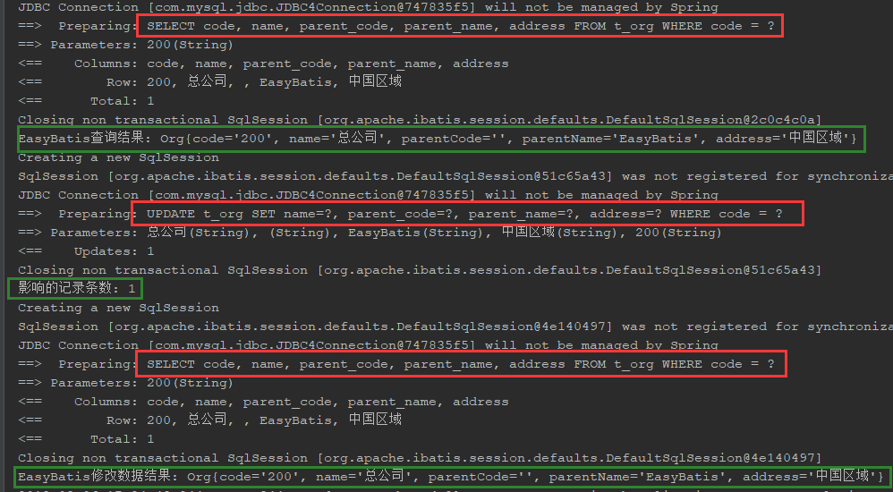
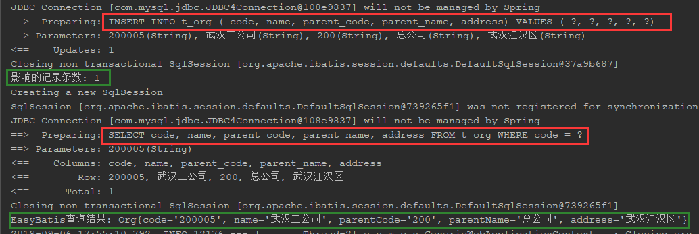
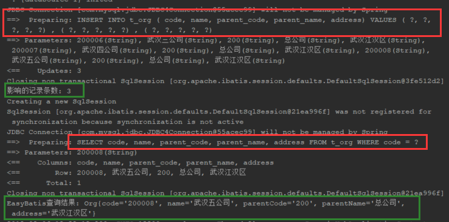
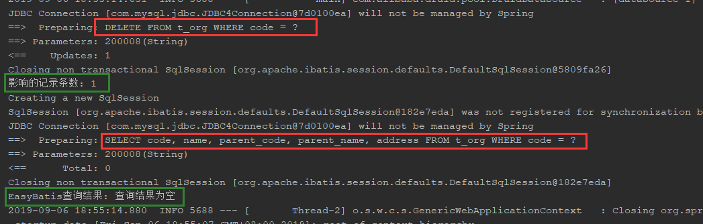

# Easybatis

**简介**：

​	EasyBatis做为一款对MyBatis无入侵的增强工具集

# 1.0 快速入门

## 1.1.0 引入EasyBatis依赖 

## 1.2.0 执行案例数据库脚本

```sql
DROP TABLE
IF EXISTS `t_org`;

CREATE TABLE IF NOT EXISTS `t_org` (
	`code` VARCHAR (32) COMMENT '机构编码',
	`name` VARCHAR (32) COMMENT '机构名称',
	`parent_code` VARCHAR (32) COMMENT '上级机构编码',
	`parent_name`  VARCHAR (32) COMMENT '上级机构名称',
	`address` VARCHAR (32) COMMENT '机构地址',
	PRIMARY KEY (`code`)
) ENGINE = INNODB COMMENT = '组织表';

INSERT INTO
	t_org (`code`, `name`, `parent_code`, `parent_name`, `address`)
VALUES
	('200', '总公司', '', '0', '中国区域'),
	('200001', '北京分公司', '200', '总公司', '北京'),
	('200002', '上海分公司', '200', '总公司', '上海'),
	('200003', '广州分公司', '200', '总公司', '广州'),
	('200004', '武汉分公司', '200', '总公司', '武汉'),
	('200004001', '事业部', '200004', '武汉分公司', '武汉'),
	('200004002', '研发部', '200004', '武汉分公司', '武汉'),
	('200004003', '售后部', '200004', '武汉分公司', '武汉'),
	('200004004', '商务部', '200004', '武汉分公司', '武汉');
```

## 1.3.0 定义实体对象

- 定义组织对象

```java
package com.xwc.open.example.entity;

import com.xwc.open.esbatis.anno.table.Id;
import com.xwc.open.esbatis.anno.table.Table;
import com.xwc.open.esbatis.enums.IdType;
/**
 * 创建人：徐卫超
 * 创建时间：2019/4/26  22:09
 */
@Table("t_org")
public class Org {
    @Id(type = IdType.CUSTOM)
    private String code;  //机构编码  自定义编码
    private String name;  //机构名称
    private String parentCode; //父机构编码;顶级机构父机构代码为空
    private String parentName; //父机构名称
    private String address; //地址信息
	// getter and setter and toString ....
}
```

## 1.4.0 导入EasyBatis组件

```java
package com.xwc.open.example;
import com.xwc.open.esbatis.EnableEsBatis;
import org.springframework.boot.SpringApplication;
import org.springframework.boot.autoconfigure.SpringBootApplication;

@SpringBootApplication
@EnableEasyBatis
public class Application {
    public static void main(String[] args) {
        SpringApplication.run(Application.class, args);
    }
}

```

## 1.5.0 定义Mapper接口

```java
package com.xwc.open.example.dao;
import com.xwc.open.esbatis.interfaces.BaseMapper;
import com.xwc.open.example.entity.Org;
import com.xwc.open.example.entity.User;
import org.apache.ibatis.annotations.Mapper;
/**
 * 创建人：徐卫超
 * 时间：2019/8/3 15:52
 */
@Mapper
public interface OrgMapper extends BaseMapper<Org, String> {
    
}

```

## 1.6.0 测试OrgMapper方法

- 定义单元测试对象

  ```java
  package com.xwc.open.example;
  
  import org.junit.runner.RunWith;
  import org.springframework.boot.test.context.SpringBootTest;
  import org.springframework.test.context.junit4.SpringRunner;
  
  /**
   * 创建人：徐卫超
   * 时间：2019/8/3 15:58
   */
  @RunWith(SpringRunner.class)
  @SpringBootTest(classes = Application.class)
  public class OrgTest {
  }
  ```

- 测试根据主键查询数据

  - 代码：

  ```java
  @RunWith(SpringRunner.class)
  @SpringBootTest(classes = Application.class)
  public class OrgTest {
      @Autowired
      private OrgMapper orgMapper;
      @Test
      public void testPrimaryKeySelect() {
          Org org = orgMapper.selectKey("200");
          System.out.println("EasyBatis查询结果: " + org.toString());
      }
   }
  ```

  - 日志和输出结果

  

  

- 测试修改数据

  - 代码

  ```java
  @RunWith(SpringRunner.class)
  @SpringBootTest(classes = Application.class)
  public class OrgTest {
      @Autowired
      private OrgMapper orgMapper;
      @Test
      public void testUpdateByPrimaryKey() {
          Org org = orgMapper.selectKey("200");
          System.out.println("EasyBatis查询结果: " + org.toString());
          org.setParentName("EasyBatis");
          Long count = orgMapper.update(org);
          System.out.println("影响的记录条数: " + count);
          org = orgMapper.selectKey("200");
          System.out.println("EasyBatis修改数据结果: " + org.toString());
      }
   }
  ```

  - 日志和输出结果

  

- 测试插入数据

  - 代码

  ```java
  @RunWith(SpringRunner.class)
  @SpringBootTest(classes = Application.class)
  public class OrgTest {
      @Autowired
      private OrgMapper orgMapper;
      @Test
      public void testInsertCutomeId() {
          Org org = new Org();
          org.setCode("200005");
          org.setName("武汉二公司");
          org.setParentName("总公司");
          org.setParentCode("200");
          org.setAddress("武汉江汉区");
          Long count = orgMapper.insert(org);
          System.out.println("影响的记录条数: " + count);
          Org dbOrg = orgMapper.selectKey("200005");
          System.out.println("EasyBatis查询结果: " + dbOrg.toString());
      }
   }
  ```

  - 日志和输出结果

  

- 测试批量插入数据

  - 代码

  ```java
  @RunWith(SpringRunner.class)
  @SpringBootTest(classes = Application.class)
  public class OrgTest {
      @Autowired
      private OrgMapper orgMapper;
      @Test
      public void testInsertBatchCutomeId() {
          Org org = orgMapper.selectKey("200");
          System.out.println("EasyBatis查询结果: " + org.toString());
      }
   }
  ```

  - 日志和输出结果

  

- 测试删除数据

  - 代码

  ```java
  @RunWith(SpringRunner.class)
  @SpringBootTest(classes = Application.class)
  public class OrgTest {
      @Autowired
      private OrgMapper orgMapper;
      @Test
      public void testDeleteByPrimaryKey() {
          Org org = orgMapper.selectKey("200");
          System.out.println("EasyBatis查询结果: " + org.toString());
      }
   }
  ```

  - 日志和输出结果

  


# 2.0 注解介绍

## 2.1.0 实体注解

- **@Table** 

  用于描述实体和表之间的关系

  | 属性  | 类型   | 备注                   |
  | ----- | ------ | ---------------------- |
  | name  | String | 描述对象与表之间的关系 |
  | value | String | 描述对象与表之间的关系 |

  

- **@Cloum**

  描述属性成员和数据表字段之间的关系

  | 属性  | 类型   | 备注 |
  | ----- | ------ | ---- |
  | colum | String | 列名 |
  | value | String | 列名 |

- **@Id**

  描述表的主键注解

  | 属性   | 类型   | 备注                                                         |
  | ------ | ------ | ------------------------------------------------------------ |
  | colum  | String | 列名                                                         |
  | value  | String | 列名                                                         |
  | IdType | enum   | GLOBAL:系统配置全局主键(默认：AUTO)<br>AUTO:使用自动增长主键<br>UUID:使用UUID主键<br>CUSTOM:自定义主键值 |

- **@Ignore**

  忽略成员属性与表的关系

- **@Loglic**

  逻辑删除，当对象出现这个注解该表就会启用逻辑删除的功能

  | 属性    | 类型 | 备注   |
  | ------- | ---- | ------ |
  | valid   | int  | 有效值 |
  | invalid | int  | 无法值 |

## 2.2.0 CRUD注解

- **@InsertSql** 

  声明Mapper对象中的一个方法为的插入方法

- **@UpdateSql**

  声明Mapper对象中的一个方法为的更新方法

- **@DeleteSql**

  声明Mapper对象中的一个方法为的删除方法

- **@SelectSql**

  声明Mapper对象中的一个方法为的查询方法

  | 属性    | 类型    | 备注                                              |
  | ------- | ------- | ------------------------------------------------- |
  | value   | string  | 需要查询的属性(默认对象声明的有效属性)            |
  | colums  | string  | 需要查询的属性(默认对象声明的有效属性)            |
  | dynamic | boolean | query对象查询查询时dynamic 自动为true(默认:false) |

- **@ParamKey**

  声明Mapper查询方法中的参数为主键。

- **@Count**

  对Mapper中的查询方法的结果进行数量统计。

- **@Distinct**

  对Mapper中的查询方法的结果进行去重。

## 2.3.0 条件注解

 - **@Equal**

   相等查询

   | 属性  | 类型   | 备注                             |
   | ----- | ------ | -------------------------------- |
   | value | string | 关联的数据库的列  默认使用属性名 |
   | colum | string | 关联的数据库的列  默认使用属性名 |

 - **@NotEqual**

   不等查询条件

   | 属性  | 类型   | 备注                             |
   | ----- | ------ | -------------------------------- |
   | value | string | 关联的数据库的列  默认使用属性名 |
   | colum | string | 关联的数据库的列  默认使用属性名 |

 - **@NotNull**

   不为空查询 ，和属性类型无关和属性是否等于NULL有关

   | 属性  | 类型   | 备注                             |
   | ----- | ------ | -------------------------------- |
   | value | string | 关联的数据库的列  默认使用属性名 |
   | colum | string | 关联的数据库的列  默认使用属性名 |

 - **@IsNull**

   为空查询，和属性类型无关和属性是否等于NULL有关

   | 属性  | 类型   | 备注                             |
   | ----- | ------ | -------------------------------- |
   | value | string | 关联的数据库的列  默认使用属性名 |
   | colum | string | 关联的数据库的列  默认使用属性名 |

 - **@Like**  左右模糊匹配查询

   | 属性  | 类型   | 备注                             |
   | ----- | ------ | -------------------------------- |
   | value | string | 关联的数据库的列  默认使用属性名 |
   | colum | string | 关联的数据库的列  默认使用属性名 |

 - **@RightLike** 右模糊匹配查询

   | 属性  | 类型   | 备注                             |
   | ----- | ------ | -------------------------------- |
   | value | string | 关联的数据库的列  默认使用属性名 |
   | colum | string | 关联的数据库的列  默认使用属性名 |

 - **@LeftLike** 左模糊匹配查询

   | 属性  | 类型   | 备注                             |
   | ----- | ------ | -------------------------------- |
   | value | string | 关联的数据库的列  默认使用属性名 |
   | colum | string | 关联的数据库的列  默认使用属性名 |

 - **@In** 包含查询

   | 属性  | 类型   | 备注                             |
   | ----- | ------ | -------------------------------- |
   | value | string | 关联的数据库的列  默认使用属性名 |
   | colum | string | 关联的数据库的列  默认使用属性名 |

 - **@NotIn** 不包含查询

   | 属性  | 类型   | 备注                             |
   | ----- | ------ | -------------------------------- |
   | value | string | 关联的数据库的列  默认使用属性名 |
   | colum | string | 关联的数据库的列  默认使用属性名 |

 - **@GreaterThan** 大于查询

   | 属性  | 类型   | 备注                             |
   | ----- | ------ | -------------------------------- |
   | value | string | 关联的数据库的列  默认使用属性名 |
   | colum | string | 关联的数据库的列  默认使用属性名 |

 - **@GreaterThanEqual ** 大于等于查询

   | 属性  | 类型   | 备注                             |
   | ----- | ------ | -------------------------------- |
   | value | string | 关联的数据库的列  默认使用属性名 |
   | colum | string | 关联的数据库的列  默认使用属性名 |

 - **@LessThan** 小于查询

   | 属性  | 类型   | 备注                             |
   | ----- | ------ | -------------------------------- |
   | value | string | 关联的数据库的列  默认使用属性名 |
   | colum | string | 关联的数据库的列  默认使用属性名 |

 - **@LessThanEqual**  小于等于查询

   | 属性  | 类型   | 备注                             |
   | ----- | ------ | -------------------------------- |
   | value | string | 关联的数据库的列  默认使用属性名 |
   | colum | string | 关联的数据库的列  默认使用属性名 |

 - **@Start**  分页查询开始值

   | 属性  | 类型   | 备注                             |
   | ----- | ------ | -------------------------------- |
   | value | string | 关联的数据库的列  默认使用属性名 |
   | colum | string | 关联的数据库的列  默认使用属性名 |

 - **@Offset**  分页查询偏移值

   | 属性  | 类型   | 备注                             |
   | ----- | ------ | -------------------------------- |
   | value | string | 关联的数据库的列  默认使用属性名 |
   | colum | string | 关联的数据库的列  默认使用属性名 |

 - **@OrderBy**  

   | 属性    | 类型    | 备注                                                         |
   | ------- | ------- | ------------------------------------------------------------ |
   | value   | string  | 关联的数据库的列  默认使用属性名                             |
   | colum   | string  | 关联的数据库的列  默认使用属性名                             |
   | order   | enum    | ASC<br>DESC                                                  |
   | byValue | boolean | 排序条件.<br>当为对象查询时true: 则采用属性by的排序语句<br>false: 采用属性名排序或方法参数名排序只和属性和参数定义有关(默认) |
   | by      | String  | 自定义排序                                                   |

## 2.4.0 审计属性

​	当对象中出现审计注解 插件将对该表的增该删进行审计处理。

- @CreateId

  | 属性   | 类型    | 备注                             |
  | ------ | ------- | -------------------------------- |
  | value  | string  | 关联的数据库的列  默认使用属性名 |
  | colum  | string  | 关联的数据库的列  默认使用属性名 |
  | hidden | boolean | 查询时 忽略该字段                |

- @CreateName

  | 属性   | 类型    | 备注                             |
  | ------ | ------- | -------------------------------- |
  | value  | string  | 关联的数据库的列  默认使用属性名 |
  | colum  | string  | 关联的数据库的列  默认使用属性名 |
  | hidden | boolean | 查询时 忽略该字段                |

- @CreateTime

  | 属性   | 类型    | 备注                             |
  | ------ | ------- | -------------------------------- |
  | value  | string  | 关联的数据库的列  默认使用属性名 |
  | colum  | string  | 关联的数据库的列  默认使用属性名 |
  | hidden | boolean | 查询时 忽略该字段                |

- @UpdateId

  | 属性   | 类型    | 备注                             |
  | ------ | ------- | -------------------------------- |
  | value  | string  | 关联的数据库的列  默认使用属性名 |
  | colum  | string  | 关联的数据库的列  默认使用属性名 |
  | hidden | boolean | 查询时 忽略该字段                |

- @UpdateName

  | 属性   | 类型    | 备注                             |
  | ------ | ------- | -------------------------------- |
  | value  | string  | 关联的数据库的列  默认使用属性名 |
  | colum  | string  | 关联的数据库的列  默认使用属性名 |
  | hidden | boolean | 查询时 忽略该字段                |

- @UpdateTime

  | 属性   | 类型    | 备注                             |
  | ------ | ------- | -------------------------------- |
  | value  | string  | 关联的数据库的列  默认使用属性名 |
  | colum  | string  | 关联的数据库的列  默认使用属性名 |
  | hidden | boolean | 查询时 忽略该字段                |

# 3.0 相关接口介绍

- AuditorAware 
  审计数据的获取接口，用户可以通过该接口控制审计插入到数据库的数据。
  例如：

``` java
@Component
public class DefaultAuditorAware implements AuditorAware {
    @Override
    public Object id() {
        return "xwcID";
    }

    @Override
    public Object name() {
        return "xwc";
    }

    @Override
    public Object time() {
        return new Date();
    }
}
```

- Page 查询分页的接口

```java
public class DefaultPage implements Page {

    @Ignore
    private Integer pageNum = 1;

    @Ignore
    private Integer pageSize = 10;

    public void setPage(Integer pageNum,Integer pageSize){
        this.pageNum = pageNum;
        this.pageSize = pageSize;
    }

    @Override
    public Integer getPageStart() {
        if (pageNum == null || pageNum < 1) {
            return 0;
        }
        return (pageNum - 1) * pageSize;
    }

    @Override
    public Integer getPageOffset() {
        if (pageSize == null || pageSize < 0) {
            return 10;
        }
        return pageSize;
    }
}
```

-  BaseEnum  枚举的映射接口 通过该接口可以实现数据库和实体之间的数据转换
- EasyMapper  标识这个接口可以启用easybatis插件

- BaseMapper  插件提供的基础增删改插的查的接口

```java
public interface BaseMapper<E, K> extends EasyMapper<E, K> {

    @SelectSql
    @ParamKey
    E selectKey(K id);

    @UpdateSql
    Long update(E entity);

    @InsertSql
    Long insert(E entity);

    @InsertSql
    Long insertBatch(Collection<E> list);

    @DeleteSql
    @ParamKey
    Long delete(K id);
}
```
